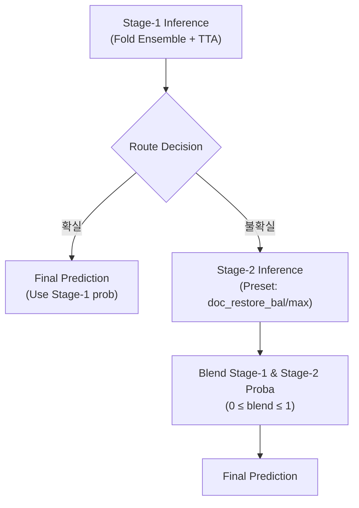

# Document Type Classification

이 프로젝트는 문서 이미지 분류 대회 참가에 사용된 솔루션으로, 컴퓨터 비전 딥러닝 기술들을 효과적으로 조합하여 최고 성능을 달성했습니다. 

특히, 모델의 일반화 성능을 극대화하고 최종 예측 정확도를 끌어올리기 위한 앙상블 및 스태킹 기법에 중점을 두어 개발되었습니다.

---

## 2조 팀원 소개

|  |  |  |  |  |
| :--------------------------------------------------------------: | :--------------------------------------------------------------: | :--------------------------------------------------------------: | :--------------------------------------------------------------: | :--------------------------------------------------------------: |
|                         |            [](https://github.com/kimyoung9689)            |            [](https://github.com/BH-Min-lab)            |            [](https://github.com/CHAERINMOON)             |            [](https://github.com/mingg210)          |
|                            팀장, 데이터 전처리 및 모델링                             |                            데이터 전처리 및 모델링                             |                            데이터 전처리 및 VLM                             |                            데이터 전처리 및 모델링                             |                            데이터 전처리 및 모델링                             |

## 0. Overview

모델 아키텍처: 본 솔루션은 ViT 기반 아키텍처(vit_base_patch16_224)를 중심으로, 클래스별 맞춤 증강·불균형 보정·2-Stage 추론을 결합해 Macro F1 기준 최고 성능을 달성했습니다.

학습 전략: 클래스 불균형 보정 + CosineAnnealingWarmup 최적화 + Clean/Robust 검증 + 2-Stage 라우팅 추론

손실 함수: Focal Loss with Class Balancing

최종 점수: Test Macro F1 Score 0.97 달성

환경: 


### Environment

- OS: Ubuntu 20.04.6 LTS (tested)  
- Python: 3.10  
- PyTorch: 2.1.0  
- CUDA: 11.8, cuDNN 8.7  
- GPU: NVIDIA GeForce RTX 3090 (24GB VRAM)  
- Dependencies: See [environment.yml](./environment.yml)

### Requirements

- python=3.10
- pytorch=2.1.0
- pytorch-cuda=11.8
- torchvision=0.16.0
- torchaudio=2.1.0
- numpy=1.26
- scipy=1.11
- scikit-learn=1.3
- pandas=2.1

---

## 1. Competiton Info

### Overview

이 대회는 문서 타입 분류를 위한 이미지 분류 대회로, 금융, 의료, 보험, 물류 등 다양한 산업 분야에서 활용되는 문서 이미지를 17개 클래스로 분류합니다. 현업 데이터를 기반으로 제작되어 실제 문제를 해결하는 경험을 제공합니다.

- **기간**: 2025년 9월 1일 ~ 2025년 9월 11일

- **주제**: 문서 이미지 분류

- **평가지표**: Macro F1 Score

$$
\text{Macro-F1} = \frac{1}{N} \sum_{i=1}^{N} F1_i
$$

$$
F1 = 2 \cdot \frac{Precision \cdot Recall}{Precision + Recall}
$$

 > - $N$: 클래스 개수 (이번 대회의 경우 17)  
 > - $F1_i$: i번째 클래스의 F1 Score  
 > - Precision = $\frac{TP}{TP + FP}$  
 > - Recall = $\frac{TP}{TP + FN}$  
 > - TP: True Positive, FP: False Positive, FN: False Negative  

- **주요 목표**:
  - **다양한 CNN 기반 Backbone (ResNet, EfficientNet 등)** 및 최신 기법을 적용 및 성능 비교  
  - **데이터 불균형 문제를 고려한 학습 기법 실험**(데이터 증강, 클래스 가중치 적용 등) 실험  
  - **Macro-F1 기준 최적 성능 달성**을 목표로 하는 모델 구축

---

## 2. Components

### Directory

프로젝트는 모듈성과 재사용성을 극대화하기 위해 다음과 같은 명확한 디렉토리 구조를 따릅니다.


```txt
.
├── data
│   ├── noisy               # src/data/EDA_mismatch.py 로 확인한 잘못 예측한 이미지 파일 저장
│   ├── test                # test 이미지 파일 저장
│   └── train               # train 이미지 파일 저장
├── img                     # EDA 결과 및 필요한 이미지 파일 저장
├── logs                    # run_scripts 배쉬 파일 실행 로그 저장
├── model                   # 각 모델 디렉토리 안에 fold별 .pt 파일 및 train_summary.json 저장
│   ├── convnext_base.fb_in22k_ft_in1k_384_auto     
│   ├── efficientnet_b4.ra2_in1k_auto
│   ├── maxvit_base_tf_512.in21k_ft_in1k_auto
│   ├── tf_efficientnet_b7.ap_in1k_auto
│   ├── vit_base_patch14_dinov2.lvd142m_auto
│   ├── vit_base_patch16_siglip_512.webli_auto
│   └── ...
├── output                  # 결과물 .csv 파일 저장
│   └── oof                 # OOF .csv 파일 저장
├── run_scripts             # 실행 명령어 .sh 파일 저장
├── src                     # 스크립트 .py 파일 저장
│   ├── data
│   │   ├── EDA.py
│   │   ├── EDA_mismatch.py
│   │   ├── dataset.py
│   │   └── transform.py
│   ├── ensemble.py
│   ├── evaluate
│   │   ├── evaluate.py
│   │   └── identify_possible_mislabeled_data.py
│   ├── inference
│   │   └── inference.py
│   ├── main.py
│   ├── output_to_submission.py
│   └── train
│       ├── correct_minor_classes.py
│       ├── schedulers.py
│       └── train.py
└── wandb                   # wandb 파일 저장
    ├── latest-run
    └── ...
```

---

## 3. Data descrption

### Dataset overview

- 이번 대회 데이터는 금융, 의료, 물류 등 다양한 분야의 실제 문서 이미지를 기반으로 구축되었으며, 총 17개의 클래스로 분류됩니다. 학습 데이터 1,570장, 평가 데이터 3,140장으로 구성되어 있습니다.

### EDA

- 클래스 불균형: 특정 클래스(1, 13, 14)의 데이터 수가 매우 적은 불균형 문제를 확인했습니다.
<p align="center">
  
</p>

- 이미지 해상도: 이미지 크기는 512px에서 763px까지 다양하게 분포되어 있음을 파악했습니다.
<p align="center">
  
  
</p>


- 레이블 정확도: 학습 데이터 중 일부 오분류된 이미지들이 존재하여, 데이터 레이블에 휴먼 에러가 일부 발견되어 수정하였습니다.
<p align="center">
  
  
  
</p>

### Data Processing

전처리: 모든 이미지를 모델의 입력 크기에 맞게 리사이즈하고, RGB 채널별로 평균 및 표준 편차를 사용해 정규화했습니다.

- **데이터 증강 (클래스별 파이프라인)**  
  - 문서류(DOC), 신분증/여권(ID_CERT), 차량(CAR) 세 집합으로 분리.  
  - 문서류는 OverlayFromPool 기반 **self/pool 혼합 overlay** 추가.  
  - 소수 클래스는 heavy transform 확률적 적용.
 
 #### 이미지 증강 파이프라인

| 클래스 | Base Transform | Heavy Transform | 추가 특징 |
|--------|----------------|-----------------|-----------|
| 문서류(DOC) | Affine, Rotate90, HueSatShift, CLAHE, Downscale, Noise | 더 강한 Affine/Noise, OverlayFromPool(base/heavy) | Document 전용 Overlay 추가 |
| 신분증/여권(ID) | Affine, ColorJitter, Noise (중간 강도) | 일부 heavy | OCR-like 손상 |
| 차량(CAR) | Affine, Contrast, Blur, Noise | 일부 heavy | 반사/노이즈 강화 |

---

## 4. Modeling

### Model description

- **모델 & 입력 크기 자동화**  
  - `timm` 기반 아키텍처 사용. 입력 크기는 `"auto"`, `"auto-long"`, 정수 지정 가능.  
  - 지원 모델 예시: ConvNeXt, EfficientNet, MaxViT, ViT(DINOv2, SigLIP) 등.

- **데이터 분할 & 재현성**  
  - `StratifiedKFold(n_splits=5, shuffle=True, random_state=42)` 사용.  
  - 시드 고정 및 torch·numpy·cudnn의 deterministic 모드 적용.

- **데이터 증강 (클래스별 파이프라인)**  
  - 문서류(DOC), 신분증/여권(ID_CERT), 차량(CAR) 세 집합으로 분리.  
  - 문서류는 OverlayFromPool 기반 **self/pool 혼합 overlay** 추가.  
  - 소수 클래스는 heavy transform 확률적 적용.

- **손실함수 & 최적화**  
  - 기본: LabelSmoothingCE  
  - 옵션: FocalLoss(γ=1.5~2.0, class-balanced weight 지원).  
  - Mixed Precision, Accumulation, Gradient Clipping, EMA 적용.  
  - 스케줄러: CosineAnnealingWarmupRestarts 적용.

- **Early Stopping & 체크포인트**  
  - `es_mode={loss|f1|both|either}`, patience=10, Δloss=0.001, Δf1=0.0005.  
  - fold별 `*_best_loss.pt`, `*_best_f1.pt` 저장.

- **검증 체계 (Validation)**  
  - clean valid + robust valid (노이즈, 압축, 다운스케일 캐시 고정).  
  - robust 검증은 실세계 성능 근접 모니터링 지표로 사용.

- **추론 (Inference)**  
  - Fold 앙상블 평균(logit or prob).  
  - TTA 지원(Flip, 90/180/270 회전).  
  - Stage-2 라우팅: 불확실 샘플만 `doc_restore_bal` 또는 `doc_restore_max` preset으로 재추론.

- **스태킹 앙상블 (Ensemble)**  
  - 다중 모델 OOF/Test 확률 → Logistic Regression meta-model.  
  - Feature 모드: `proba`, `logproba`, `both`. 내부 CV로 `C` 선택, 지표=macro F1.

#### 아키텍처 & 하이퍼파라미터 조합 예시

| 모델 아키텍처 | 입력 크기 | Epochs | Effective Batch Size | LR (max) | 스케줄러 | 손실함수 |
|---------------|-----------|--------|------------|-----------|----------|-----------|
| ConvNeXt-B    | auto(384) | 150    | 32         | 3e-4      | CosineAnnealingWarmupRestarts | LabelSmoothingCE |
| EfficientNet-B4 | 512     | 150     | 32         | 3e-4      | 동일     | LabelSmoothingCE |
| MaxViT-B      | auto(512)       | 150     | 32         | 1e-4      | 동일     | Focal |
| ViT-B SigLIP  | auto(512)       | 150     | 32         | 7e-5      | 동일     | Focal |
| ViT-B DINOv2  | auto(518)   | 150     | 32         | 5e-5      | 동일     | Focal|


#### 2단계 라우팅 추론 다이어그램


| 항목 | 설명 |
|------|------|
| Routing 기준 | entropy / margin / sum / pred |
| Gate | default = 0.60, Stage-2 샘플 수 제한(`stage2_limit`) 가능 |
| Blend | 1.0 = Stage-2만, 0.5 = 동등 블렌드, 0 = Stage-1 유지 |

---

## 5. Result

### Leader Board

* 
* 


### 모델 학습 결과 요약

* 사용한 모델: ViT-B-16-SigLIP (단일모델)

* Confusion matrix
<p align="center">
  
</p>

* Learning Curve
</p>
<p align="center">
  
</p>

* Training loss/f1
<p align="center">
  
  
</p>

* Validation loss/f1 (Clean) 
<p align="center">
  
  
</p>

* Validation loss/f1 (Robust)
<p align="center">
  
  


### Presentation

- [Google Slides](https://docs.google.com/presentation/d/10o12igXX3xXg1zpI-M4KdHMrxI4OToEL/edit?slide=id.p5#slide=id.p5)

---

## 6. How to Run 

### Setup

#### 1. 환경 설정

```bash
# (필요 시) Conda 환경 생성
conda env create -f environment.yml
conda activate <your-env>
```

#### 2. 학습 및 추론 실행
src.main으로 전체 학습 파이프라인을 실행합니다. (--do_infer를 주면 학습 직후 추론까지 수행)

예시)

```bash
python -m src.main \
  --arch resnetrs50.tf_in1k \
  --img_size auto \
  --n_folds 5 --epochs 70 --batch_size 32 \
  --lr 3e-4 --accum_steps 2 --use_ema \
  --eval_mode f1 --es_mode either --patience 10 \
  --use_focal --focal_gamma 1.8 --focal_weight alpha_cb \
  --use_logit_adjustment --logit_tau 1.0 \
  --save_oof_folds --save_fold_logs \
  --do_infer --save_proba --tta --avg logit
```

핵심 옵션 요약:
* --img_size auto: 모델 기본 권장 해상도에 맞춤  
* --n_folds 5: 5-Fold CV  
* --use_focal/--use_logit_adjustment: 클래스 불균형 보정(옵션)  
* --es_mode either: Loss 또는 F1 개선 중 하나면 계속, 모두 악화 시 조기종료(early stopping)   
* --do_infer: 학습 후 1-Stage 추론(TTA/앙상블 포함)

#### 3. 추론만 따로 실행 (특히 2-stage 추론을 이용하여 다양하게 비교하고 싶은 경우)

예시)

```bash
python -m src.inference.inference \
  --arch resnetrs50.tf_in1k \
  --img_size auto \
  --summary_path model/resnetrs50.tf_in1k_auto/train_summary.json \
  --test_dir data/test --output_dir output \
  --avg prob --infer_batch_size 64 --num_workers 8 --tta --save_proba \
  --stage1_presets "none,doc_deskew" \
  --stage2_preset doc_restore_max \
  --stage2_mode sum --route_classes "3,7,11" \
  --route_gate 0.65 \
  --stage2_blend 0.85 \
  --out_tag "2-stage"
```

핵심 옵션 요약:
* Stage-1: 기본 추론(TTA/폴드 평균) → 불확실 샘플만 선별
* Stage-2: 복원 강화 preset(doc_restore_max)로 재추론 후 Stage-1과 블렌딩
* --route_classes "3,7,11": 지정 클래스만 라우팅
* --route_gate 0.65: 라우팅 임계값
* --stage2_blend 0.85: Stage-2 비중(0~1)


#### 4. 최종 제출 파일 생성
추론 결과를 대회 제출 형식으로 변환합니다.

```bash
python -m src.output_to_submission
```
기본 동작: output/*.csv → output/submission/에 ID,target 형식으로 저장(중복 시 자동 넘버링)

#### 5. (선택) 스태킹 앙상블
최종 제출은 단일 모델을 사용했지만, 필요 시 OOF/Test 확률을 이용해 로지스틱 회귀 메타모델로 스태킹을 수행할 수 있습니다.

예시)
```bash
python -m src.ensemble \
  --oof  output/oof/resnetrs50.tf_in1k_auto_oof.csv \
        output/oof/vgg16_bn.tv_in1k_auto_oof.csv \
  --test output/resnetrs50.tf_in1k_auto_2-stage.csv \
        output/vgg16_bn.tv_in1k_auto_2-stage.csv \
  --feature both --standardize \
  --cv_k 10 --C_grid 0.01 0.03 0.05 0.07 0.1 0.25 0.5 1.0 2.0 4.0 --max_iter 5000 \
  --target_csv data/sample_submission.csv --also_geomean
```
핵심 옵션 요약:
* --oof: 학습 과정에서 생성된 각 모델의 OOF(out-of-fold) 예측 CSV 파일 경로
* --test: 대응되는 각 모델의 테스트셋 예측 CSV 파일 경로
* --feature both: 스태킹 입력 특징으로 확률값(proba)과 로그 확률값(log-proba) 모두 사용
* --cv_k 10: 메타모델 학습 시 내부 교차검증 fold 수 (10-Fold CV)
* --C_grid: 로지스틱 회귀의 규제 강도 C에 대해 탐색할 후보 값 리스트
* --max_iter 5000: 로지스틱 회귀 최대 반복 수 (수렴 안정성 확보)
* --target_csv: 최종 제출 형식(예: sample_submission.csv)을 참고하여 출력 컬럼 맞춤
* --also_geomean: 메타모델 결과 외에 단순 기하평균(geometric mean) 앙상블 결과도 함께 생성

---

## ETC

### Meeting Log

- 본 프로젝트 진행 과정에서 작성된 회의 기록 및 실험 로그는 이 레포지토리를 참고해주세요.

### Reference

- [Stages.ai](https://stages.ai/en) — 본 대회 플랫폼  
- [PyTorch Documentation](https://pytorch.org/docs/stable/index.html)  
- [timm (PyTorch Image Models)](https://github.com/huggingface/pytorch-image-models)  
- [Albumentations](https://github.com/albumentations-team/albumentations)  
- [scikit-learn Documentation](https://scikit-learn.org/stable/documentation.html)  
- [OpenCV](https://docs.opencv.org/4.x/d6/d00/tutorial_py_root.html)  
- [Vision Transformer (ViT) paper](https://arxiv.org/abs/2010.11929)  
- [MaxViT paper](https://arxiv.org/abs/2204.01697)  
- [ConvNeXt paper](https://arxiv.org/abs/2201.03545)  
- [EfficientNet paper](https://arxiv.org/abs/1905.11946)  
- [DINOv2 paper](https://arxiv.org/abs/2304.07193)  
- [SigLIP paper](https://arxiv.org/abs/2303.15343)  
- [Weights & Biases (W&B)](https://docs.wandb.ai/)  

### Acknowledgement
본 프로젝트는 Upstage AI Lab 14기 교육 과정의 일환으로 진행되었으며, 팀원들의 협업과 피드백을 통해 완성되었습니다.

---
